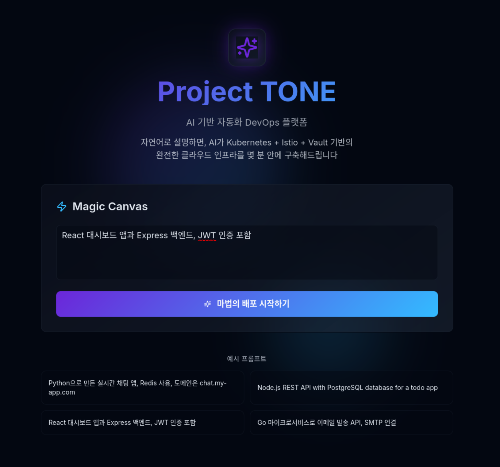
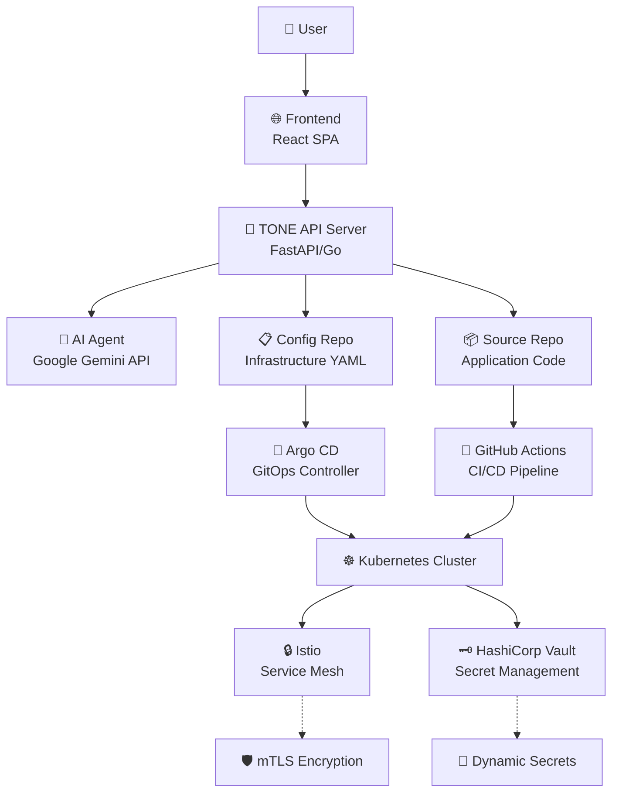

# Project TONE 🎵
*AI-Powered Self-Driving Cloud Platform*

[](https://github.com/nodove/tone-ai-devops)
[](LICENSE)
[](https://github.com/nodove/tone-ai-devops/actions)

---

## Preview | 미리보기



## 🌟 Vision & Mission | 비전 및 목표


### English
**Problem**: Even experienced developers face high barriers when deploying and operating services in cloud-native environments (MSA, Kubernetes, Service Mesh). They must learn vast, fragmented infrastructure knowledge.

**Vision**: Build a 'Self-Driving' cloud platform where developers can focus solely on business logic without worrying about infrastructure.

**Mission**: Provide an innovative developer experience where users can instantly deploy their ideas using natural language or simple diagrams and receive security-embedded live services within minutes.

### 한국어  
**문제점**: 숙련된 개발자조차 클라우드 네이티브 환경(MSA, 쿠버네티스, 서비스 메시 등)에서 서비스를 배포하고 운영하기 위해 방대하고 파편화된 인프라 지식을 학습해야 하는 높은 진입장벽이 존재합니다.

**비전**: 개발자가 인프라에 대한 고민 없이 오직 비즈니스 로직에만 집중할 수 있는 'Self-Driving' 클라우드 플랫폼을 구축합니다.

**목표**: 사용자가 자연어나 간단한 구성도만으로 자신의 아이디어를 즉시 배포하고, 보안이 내재화된 라이브 서비스를 몇 분 안에 제공받는 혁신적인 개발자 경험을 제공합니다.

---

## 🎼 Core Philosophy | 핵심 철학

Project TONE is built on three fundamental principles:

### 1. 🎵 Tone-Based Communication (음색 기반 통신)
Every service (Pod) receives a unique cryptographic identity (SPIFFE ID). This 'tone' becomes the foundation for all interactions - service communication rules (AuthorizationPolicy), secret access permissions (Vault) - automatically implementing Zero Trust security without additional configuration.

### 2. 📋 Git as Blueprint (설계도로서의 Git)  
Git repositories containing infrastructure blueprints (Kubernetes/Istio YAML) serve as the platform's 'Single Source of Truth'. All changes occur through Git commits, making every system state transparently trackable and manageable.

### 3. 🎭 Servers are Empty Stages (서버는 텅 빈 무대)
Physical servers or virtual machines are merely empty spaces. All intelligence and configuration reside in 'blueprints' stored in Git. This allows services to move freely between clusters without infrastructure dependency.

---

## 🏗️ System Architecture | 시스템 아키텍처



### Components | 구성 요소

| Component | Technology | Role |
|-----------|------------|------|
| **Frontend** | React + TypeScript + Tailwind | User Interface & Magic Canvas |
| **Backend** | FastAPI/Go + PostgreSQL | Workflow Orchestration & API |
| **AI Agent** | Google Gemini API | Natural Language → YAML Generation |
| **GitOps** | Argo CD | Automated Deployment |
| **Runtime** | Kubernetes + Istio + Vault | Secure Execution Environment |
| **CI/CD** | GitHub Actions | Code Build & Deploy |

---

## 🎯 User Workflow | 사용자 워크플로우

### 5-Step Magic Deployment | 5단계 마법 배포

```
1️⃣ [Magic Canvas] 
   User inputs requirements in natural language
   사용자가 자연어로 요구사항 입력
   ↓
   
2️⃣ [AI Generation]
   Gemini API generates K8s + Istio + Vault YAML
   Gemini API가 완벽한 YAML 설계도 생성
   ↓
   
3️⃣ [GitOps Deploy]
   Auto-commit to Config Repo → Argo CD sync
   Config Repo에 자동 커밋 → Argo CD 동기화
   ↓
   
4️⃣ [Code Connect]
   Provide Source Repo link for application code
   애플리케이션 코드용 Source Repo 링크 제공
   ↓
   
5️⃣ [Live Service]
   Code push → CI/CD → Live URL ready!
   코드 푸시 → CI/CD → 라이브 URL 완성!
```

### Example Usage | 사용 예시

**Input (입력):**
```
"Python으로 만든 실시간 채팅 앱, Redis 사용, 도메인은 chat.my-app.com"
```

**Output (출력):**
- 🌐 **Live URL**: `https://chat.my-app.com`
- 📦 **Source Repo**: `https://github.com/tone-platform/my-chat-app`
- 📋 **Config Repo**: `https://github.com/tone-platform/my-chat-app-config`
- 🛡️ **Security**: Zero Trust + mTLS + Dynamic Secrets (자동 적용)

---

## 🚀 Quick Start | 빠른 시작

### Prerequisites | 사전 요구사항
- Node.js 18+ and npm/yarn
- Docker & Kubernetes cluster access
- Google Cloud account (for Gemini API)
- GitHub account

### Frontend Development | 프론트엔드 개발

```bash
# Clone repository
git clone <YOUR_GIT_URL>
cd tone-ai-devops

# Install dependencies
npm install

# Start development server
npm run dev

# Build for production
npm run build

# Lint & type check
npm run lint
```

### Environment Setup | 환경 설정

```bash
# Copy environment template
cp .env.example .env

# Configure required variables
VITE_API_BASE_URL=http://localhost:8000
VITE_GEMINI_API_KEY=your_gemini_key
VITE_GITHUB_TOKEN=your_github_token
```

---

## 🛠️ Technology Stack | 기술 스택

### Frontend Stack
```json
{
  "framework": "React 18 + TypeScript",
  "styling": "Tailwind CSS + shadcn/ui",
  "build": "Vite 5",
  "state": "React Query + Local State",
  "routing": "React Router",
  "realtime": "Server-Sent Events (SSE)"
}
```

### Backend Stack (Planned)
```json
{
  "api": "FastAPI (Python) or Gin (Go)",
  "database": "PostgreSQL + Redis",
  "ai": "Google Gemini API (Function Calling)",
  "git": "GitHub API + PyGithub/go-git",
  "auth": "JWT + OAuth",
  "deploy": "Docker + Kubernetes"
}
```

### Infrastructure Stack
```json
{
  "orchestration": "Kubernetes (GKE recommended)",
  "service_mesh": "Istio (mTLS + SPIFFE)",
  "secrets": "HashiCorp Vault",
  "gitops": "Argo CD",
  "ci_cd": "GitHub Actions",
  "monitoring": "Prometheus + Grafana"
}
```

---

## 📋 Current Features | 현재 기능

### ✅ Implemented (구현됨)
- 🎨 **Magic Canvas**: Natural language input interface
- 📊 **Real-time Logs**: Live deployment status tracking  
- 📱 **Responsive UI**: Mobile-friendly design
- 🎭 **State Management**: Canvas → Deploying → Results flow
- 🎨 **Theme Support**: Dark/light mode ready
- ♿ **Accessibility**: ARIA labels and keyboard navigation

### 🚧 In Progress (진행중)
- 🔌 **API Integration**: Connect to TONE backend
- 🔄 **WebSocket/SSE**: Real-time log streaming
- 🤖 **AI Mock**: Simulated Gemini responses

### 📝 Planned (계획됨)
- 🔐 **Authentication**: User login and project management
- 🎯 **Canvas Drawing**: Visual service composition
- 📈 **Analytics**: Deployment metrics and monitoring
- 🌍 **i18n**: Korean/English localization

---

## 🗺️ Development Roadmap | 개발 로드맵

### Phase 1: Infrastructure Foundation (1 Month) | 인프라 기반 구축
- [x] Frontend MVP with Magic Canvas
- [ ] Kubernetes + Istio + Argo CD + Vault setup  
- [ ] Manual GitOps pipeline validation
- [ ] TONE API server basic structure

**Deliverable**: Deploy apps via GitOps without AI

### Phase 2: AI Integration MVP (2 Months) | AI 연동 MVP
- [ ] Gemini API integration & prompt engineering
- [ ] Single service deployment ("deploy nginx")  
- [ ] Auto-commit and deployment workflow
- [ ] Complete frontend-backend integration

**Deliverable**: "nginx 띄워줘" → live web server

### Phase 3: Advanced Features (2 Months) | 기능 고도화  
- [ ] Complex multi-service deployments
- [ ] Istio AuthorizationPolicy auto-generation
- [ ] Vault dynamic secret injection
- [ ] Domain connection automation

**Deliverable**: "Deploy chat server + Redis with isolated communication"

### Phase 4: Production Release (1 Month) | 정식 출시
- [ ] Canvas drawing functionality
- [ ] User authentication & project management  
- [ ] Platform stability & performance optimization
- [ ] Documentation & examples

**Deliverable**: Full-featured v1.0 release

---

## 🧪 API Design | API 설계

### REST Endpoints (Planned)
```typescript
// Authentication
POST /auth/login
GET  /me

// Projects  
POST /projects
GET  /projects
GET  /projects/:id

// Deployments
POST /projects/:id/runs
GET  /runs/:id
GET  /runs/:id/logs (SSE)

// Artifacts
GET  /runs/:id/plan
```

### WebSocket Events
```typescript
interface LogEvent {
  id: string;
  timestamp: Date;
  code: 'ANALYZING' | 'GENERATING' | 'COMMITTING' | 'DEPLOYING';
  message: string;
  status: 'pending' | 'running' | 'completed' | 'error';
  details?: string;
}
```

---

## 🔒 Security Model | 보안 모델

### Zero Trust Architecture | 제로 트러스트 아키텍처
- **Identity**: SPIFFE/SPIRE for service identity
- **Communication**: mTLS encryption by default
- **Authorization**: Fine-grained Istio policies
- **Secrets**: Dynamic injection via Vault
- **Audit**: All changes tracked via Git commits

### Security Features | 보안 기능
- 🛡️ **Automatic mTLS**: All service communication encrypted
- 🔐 **Dynamic Secrets**: No hardcoded credentials
- 🎯 **Least Privilege**: Services can only access required resources
- 📝 **Audit Trail**: Complete deployment history in Git
- 🚫 **Network Policies**: Default deny, explicit allow rules

---

## 🤝 Contributing | 기여하기

We welcome contributions! Please read our [Contributing Guide](CONTRIBUTING.md) for details.

### Development Guidelines | 개발 가이드라인
1. **Code Style**: Follow TypeScript/ESLint rules
2. **Commits**: Use conventional commits format
3. **Testing**: Add tests for new features
4. **Documentation**: Update README for significant changes

### Setting up Development Environment | 개발 환경 설정
```bash
# Install dependencies
npm install

# Run linting
npm run lint

# Run type checking  
npx tsc --noEmit

# Run tests (when implemented)
npm test
```

---

## 📄 License | 라이센스

This project is licensed under the MIT License - see the [LICENSE](LICENSE) file for details.

---

## 🙋‍♂️ Support | 지원

### Documentation | 문서
- 📚 **API Docs**: Coming soon
- 🎥 **Video Tutorials**: Coming soon
- 💬 **Community**: GitHub Discussions

### Contact | 연락처
- 📧 **Email**: support@tone-platform.dev
- 🐛 **Issues**: [GitHub Issues](https://github.com/nodove/tone-ai-devops/issues)
- 💬 **Discussions**: [GitHub Discussions](https://github.com/nodove/tone-ai-devops/discussions)

---

## 🏆 Expected Impact | 기대 효과

### For Developers | 개발자를 위한
- ⚡ **10x Faster**: Deploy in minutes, not days
- 🛡️ **Security by Default**: Zero Trust without complexity  
- 🧠 **Focus on Logic**: No infrastructure knowledge required
- 📈 **Rapid Prototyping**: Idea to production instantly

### For Organizations | 조직을 위한
- 💰 **Cost Reduction**: Fewer DevOps specialists needed
- 🔒 **Enhanced Security**: Automated compliance & auditing
- 📊 **Transparency**: All infrastructure as code
- 🔄 **Disaster Recovery**: Reproducible deployments

---

<div align="center">

### 🎵 "Turn your ideas into reality with just your voice" 

**Project TONE** - Where Infrastructure Becomes Music

*Built with ❤️ by the TONE Team*

---

[](https://github.com/nodove/tone-ai-devops)
[](https://github.com/nodove/tone-ai-devops/fork)
[](https://github.com/nodove/tone-ai-devops/issues)

</div>
